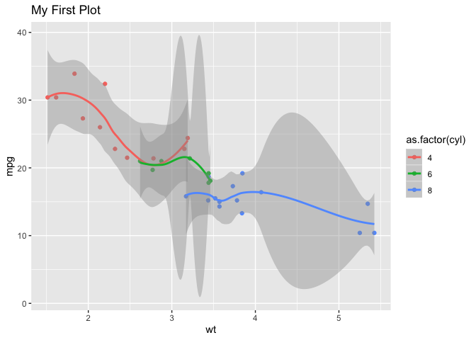

Here is a ggplot chart


```r
mtcars %>%
        ggplot(aes(x = wt, y = mpg, color = as.factor(cyl))) +
        geom_point() +
        geom_smooth() +
        ggtitle("My First Plot")
```

```
## `geom_smooth()` using method = 'loess' and formula 'y ~ x'
```

<!-- -->

